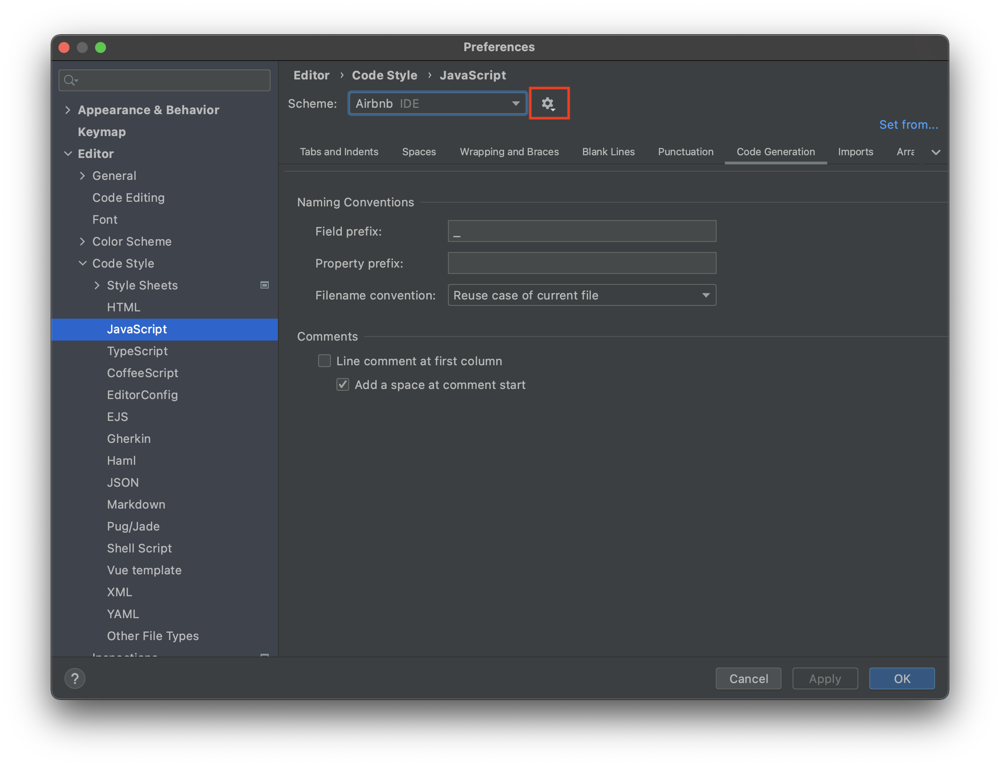

# Code Style и Prettier

## Summary

Хороший код бывает написан чисто и организованно. Он всегда следует определенным грамматическим и синтаксическим правилам. Каждая команда во время разработки выбирает определенный стиль написания кода и пытается придерживаться его в течение всей разработки.

Выбираемый стиль обычно зависит от языка программирования и от используемого фреймворка.

Среди JavaScript-разработчиков популярными являются стили написания кода (стайл гайды, style guide) [Airbnb Style Guide](https://github.com/leonidlebedev/javascript-airbnb) и [JavaScript Standard Style](https://standardjs.com/). Во многом они похожи друг на друга, но первый является наиболее популярным.

Существуют также инструменты, которые позволяют отслеживать и фиксить код в соответствии с этими стандартами.

В данном челлендже мы ознакомимся с одним из стайл гайдов и разберем библиотеку для форматирования кода, которая называется Prettier.

**Что делает Prettier:**
- добавляет пробелы и переносы там где нужно;
- удаляет лишние пробелы и переносы;
- добавляет нужные символы (скобки, запятые, точка с запятой и т.д.);
- удаляет символы там, где они не нужны;

**Что НЕ делает Prettier:**
- не исправляет ошибки в коде;
- не исправляет названия переменных/функций;
- не вносит корректировки в логику программы;

## Releases
### Pre-release: Read the Style Guide

Прежде чем мы начнем делать код-рефакторинг ознакомься со [стайл гайдом от Airbnb](https://github.com/leonidlebedev/javascript-airbnb).

Разделы, которые тебе еще не знакомы можно пропустить.

Рассмотри внимательно примеры приводимых кодов и попытайся понять почему применяется тот или иной стандарт.

### Release 0: Установка Prettier

Есть несколько способов применить Prettier к нашему коду. К примеру это можно сделать через терминал либо через интерфейс WebStorm'а. И в том и в другом случае предварительно нужно установить Prettier в проект, которые будет форматироваться.

Установка производится следующей командой

```
npm install prettier --save-dev
```

В данной команде модификатор `--save-dev` означает, что пакет устанавливается как [_зависимость разработчика_](https://ru.hexlet.io/courses/js-setup-environment/lessons/dev-dependencies/theory_unit).

#### Задачи 

1) Сделай форк данного репозитория и склонируй его на свой комп.
2) Инициализируй в папке новый проект node.
3) Установи Prettier
   
### Release 1: Применяем Prettier

Исследуй файл `index.js`. Обрати внимание на форматирование кода, однако не вноси никаких изменений.

Ответь на вопросы: 
- какие проблемы в коде ты видишь?
- есть ли в коде проблемы с названиями переменных?
- удобно ли читать данный код?

Затем набери в терминале команду 

```
npx prettier index.js -w
```

Открой файл `index.js` еще раз. После набора предыдущей команды он должен быть отформатирован.

### Release 2: Именование

Постарайся понять назначение написанного кода. Дай переменным названия, наиболее подходящие по смыслу.

### Закрепление

Установи и примени Prettier для трёх самых больших проектов из предыдущих челленджей.

Затем прочитай о дополнительных настройках и возможностях Prettier на его официальном сайте.

<details>
<summary>Настройка WebStorm</summary>
Настрой WebStorm так, чтобы он помогал тебе придерживаться стиля airbnb при написании кода.

Перейди на [эту страницу](https://gist.github.com/mentos1386/aa18c110dc272514d592ec27e98128be#file-webstorm-airbnb-javascript-codestyle-xml) и скачай себе файл (нажми на кнопку Raw, затем нажми `ctrl+s`). Открой настройки WebStorm (File -> Settings). Далее перейди в Editor -> Code Style -> JavaScript.

Напротив пункта `Scheme` нажми на иконку настроек -> выбери `Import scheme` и укажи сохраненный ранее файл. После этого жми OK для сохранения.



</details>


## Заключение

После текущего челленджа Prettier должен стать твоим постоянным помощником. Устанавливай его во все свои проекты в node. Его отсутствие будет считаться ошибкой.

Не забывай и о других сторонах стайл гайда: по чаще заглядывай в airbnb style guide, пытайся запомнить как можно больше правил оттуда. Самое главное – попытайся понять чему то или иное правило рекомендовано к использованию.
